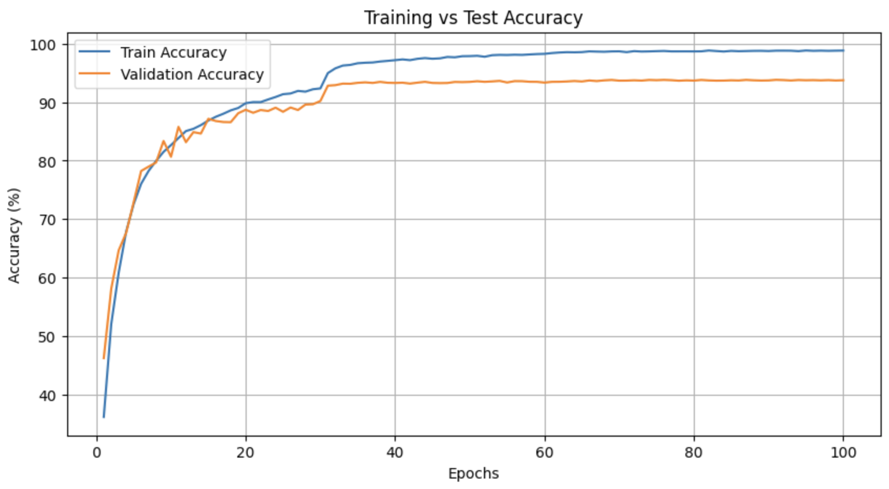

# ResNet-18 CIFAR-10 Image Classification (4.3M Params ONLY!)

A deep learning project implementing **ResNet-18** for **CIFAR-10 image classification** using **PyTorch**.  
The model is trained **from scratch**, keeping the number of parameters **under 5 million**, and achieves **94%+ validation accuracy**.  
This repository includes **data preprocessing, training, evaluation, inference, and visualizations**.

---

## **Project Overview**
This project builds and trains a **ResNet-18 model** on **CIFAR-10**, with the following features:
- **Custom ResNet-18 architecture** with **skip connections**.
- **Data Augmentation** (Rotation, Cropping, Flipping, Color Jitter).
- **Training & Evaluation** with accuracy/loss visualization.
- **Optimized Training** using **SGD, Learning Rate Scheduling**.
- **Inference Pipeline** for generating predictions on test images.
- **Model Checkpointing** for reuse and deployment.
- **Visualization of Training Graphs**.

## **Repository Structure**
```plaintext
resnet-cifar10-classification-5M-params
[CIFAR-10 Dataset Files (Stored in the root directory)]
│── .gitattributes         # Git LFS settings
│── README.md              # Project documentation
│── readme.html            # Additional documentation (HTML format)
│── DL_V2_100epochs.ipynb  # Jupyter Notebook for training and evaluation
├── batches.meta
├── cifar_test_nolabel.pkl
├── test_batch
├── data_batch_1
├── data_batch_2
├── data_batch_3
├── data_batch_4
├── data_batch_5
│── images/                # Folder containing training graphs
    ├── loss.png           # Training & Validation Loss Graph
    ├── accuracy.png       # Training & Validation Accuracy Graph
```

## **Installation & Setup**

### **1. Clone the Repository**
```bash
git clone https://github.com/igopalakrishna/resnet-cifar10-classification-5M-params.git
cd resnet-cifar10-classification-5M-params
```

### **2. Open in Google Colab**
Instead of running locally, you can upload the `.ipynb` file to **Google Colab** and execute the notebook.

1. **Download the Jupyter Notebook (`.ipynb`) file** from the repository.
2. Go to [Google Colab](https://colab.research.google.com/).
3. Click on **Upload Notebook** and select the `.ipynb` file.
4. Run all cells to train and evaluate the model.

---

## **Training Results**
- **Final Training Accuracy:** `98.81%`
- **Final Validation Accuracy:** `93.74%`
- **Final Validation Loss:** `0.2471`

### **Training & Validation Graphs**
#### **Training Loss & Validation Loss**
  

### **Training Accuracy & Validation Accuracy**




---
## **Dataset**
We use the **CIFAR-10 dataset**, which consists of **60,000 32×32 color images** in **10 classes**:

- ✈️ Airplane  
- 🚗 Automobile  
- 🐦 Bird  
- 🐱 Cat  
- 🦤 Deer  
- 🐶 Dog  
- 🐸 Frog  
- 🐎 Horse  
- 🚢 Ship  
- 🚚 Truck  

The dataset files are **directly in the root directory**:
```plaintext
batches.meta
cifar_test_nolabel.pkl
test_batch
data_batch_1
data_batch_2
data_batch_3
data_batch_4
data_batch_5
```
Dataset is automatically downloaded via `torchvision.datasets.CIFAR10`.

---

## **Next Steps**
- **Experiment with deeper ResNet models (ResNet-34, ResNet-50)**
- **Implement advanced regularization (Dropout, CutMix, Mixup)**
- **Deploy the model using Flask or FastAPI for real-time predictions**
- **Fine-tune on CIFAR-100 for a more challenging task**

---

## **References**
- [ResNet Paper (He et al., 2015)](https://arxiv.org/abs/1512.03385)
- [PyTorch Documentation](https://pytorch.org/docs/stable/index.html)
- [CIFAR-10 Dataset](https://www.cs.toronto.edu/~kriz/cifar.html)

---

## **Contributing**
Contributions are welcome!  
If you'd like to improve the model or add new features, feel free to **open an issue or submit a pull request**.

---

## **License**
This project is licensed under the **MIT License**.

---

## **Show Support**
If you found this project useful, **give it a star ⭐ on GitHub!**  
Happy coding! 

---

   

